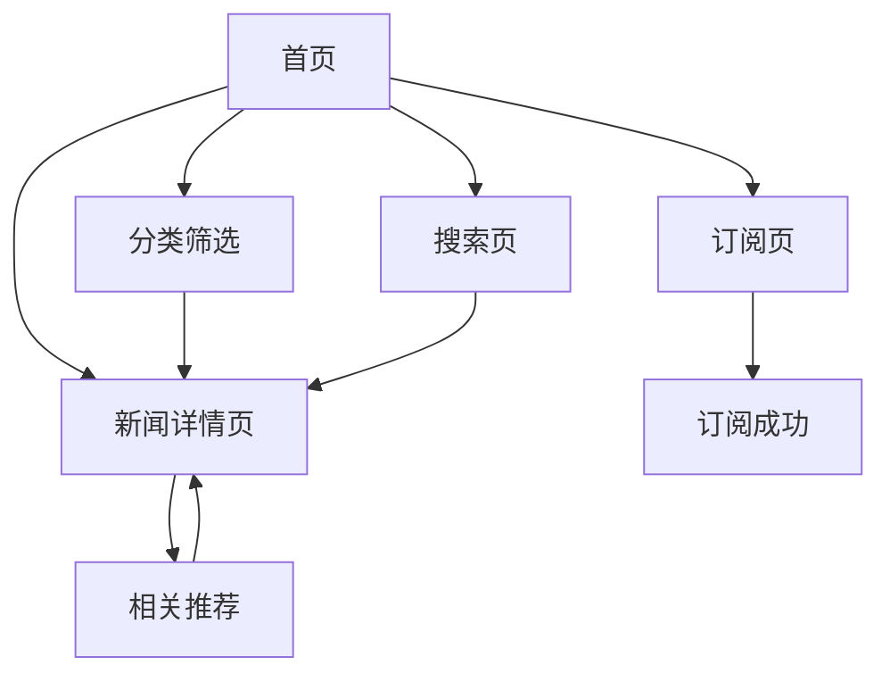

# 行业新闻聚合网站 - 产品需求文档

## 1. 产品概述

一个每周自动更新的行业新闻聚合平台，专注于数据中心、IDC、CDN、云计算等领域的新闻资讯、政策动向和风险提示，为行业从业者提供一站式信息获取服务。

目标用户：数据中心运营人员、IDC服务商、云计算从业者、行业分析师、企业IT决策者。

## 2. 核心功能

### 2.1 用户角色

| 角色 | 注册方式 | 核心权限 |
|------|----------|----------|
| 访客 | 无需注册 | 浏览所有新闻、搜索、筛选分类 |
| 订阅用户 | 邮箱订阅 | 接收每周精选邮件、收藏文章 |

### 2.2 功能模块

网站包含以下核心页面：

1. **首页**：新闻瀑布流、分类筛选、热门标签、订阅入口
2. **分类页**：按行业分类展示新闻列表
3. **详情页**：新闻全文阅读、相关推荐、分享功能
4. **搜索页**：关键词搜索、高级筛选、搜索结果
5. **订阅页**：邮箱订阅表单、订阅管理

### 2.3 页面详情

| 页面名称 | 模块名称 | 功能描述 |
|----------|----------|----------|
| 首页 | Hero区域 | 展示网站标题、简介、本周热点新闻轮播 |
| 首页 | 分类导航 | 横向标签栏：数据中心、IDC、CDN、云计算、政策法规、风险提示 |
| 首页 | 新闻瀑布流 | 卡片式新闻列表，展示标题、摘要、发布时间、来源、分类标签 |
| 首页 | 侧边栏 | 热门标签云、最新政策、风险提示摘要 |
| 首页 | 订阅入口 | 邮箱输入框+订阅按钮，引导用户订阅周报 |
| 分类页 | 分类标题 | 当前分类名称、新闻数量统计 |
| 分类页 | 筛选器 | 时间范围选择（近7天/近30天）、排序方式（最新/最热） |
| 分类页 | 新闻列表 | 分页展示该分类下的所有新闻 |
| 详情页 | 文章头部 | 标题、发布时间、来源、分类标签、阅读时长估计 |
| 详情页 | 文章内容 | 富文本渲染、图片展示、原文链接 |
| 详情页 | 相关推荐 | 底部展示3-5篇相关新闻 |
| 详情页 | 分享功能 | 复制链接、分享到微信/微博（可选） |
| 搜索页 | 搜索框 | 关键词输入、搜索建议 |
| 搜索页 | 筛选条件 | 分类筛选、时间筛选 |
| 搜索页 | 结果列表 | 高亮显示匹配关键词的搜索结果 |
| 订阅页 | 订阅表单 | 邮箱输入、分类偏好选择、订阅确认 |
| 订阅页 | 订阅管理 | 查看/修改订阅偏好、取消订阅 |

## 3. 核心流程

### 访客浏览流程
用户访问首页 → 浏览新闻瀑布流 → 点击分类标签筛选 → 点击感兴趣的新闻 → 阅读详情 → 返回继续浏览或订阅周报

### 搜索流程
用户在首页/导航点击搜索 → 输入关键词 → 查看搜索结果 → 点击新闻阅读详情

### 订阅流程
用户点击订阅入口 → 输入邮箱地址 → 选择感兴趣的分类 → 确认订阅 → 收到确认邮件 → 每周收到精选周报

## 4. 用户界面设计

### 4.1 设计风格

- **主色调**：深蓝色 (#1e40af) 作为品牌色，体现专业可信；白色背景保证阅读舒适
- **辅助色**：浅灰 (#f3f4f6) 用于卡片背景，橙色 (#f97316) 用于风险提示标签
- **按钮样式**：圆角矩形（radius: 8px），主按钮使用品牌色，悬停时加深
- **字体**：系统默认无衬线字体，标题使用较大字号（24-32px），正文16px，行高1.6
- **布局风格**：卡片式布局，顶部固定导航栏，内容区采用两栏布局（主内容+侧边栏）
- **图标风格**：使用 Lucide 图标库，线性风格，保持简洁一致

### 4.2 页面设计概述

| 页面名称 | 模块名称 | UI元素 |
|----------|----------|--------|
| 首页 | Hero区域 | 全宽背景图，居中大标题"行业新闻聚合"，副标题说明网站定位，下方本周热点横向滚动卡片 |
| 首页 | 分类导航 | 固定在顶部下方的标签栏，选中状态使用品牌色底纹，支持横向滚动 |
| 首页 | 新闻瀑布流 | 响应式网格布局，桌面端3列，卡片带阴影悬停效果，展示封面图、标题、摘要、元信息 |
| 首页 | 侧边栏 | 固定宽度280px，标签云使用不同字号表示热度，政策/风险提示使用列表形式 |
| 详情页 | 文章区域 | 最大宽度800px居中，标题使用H1样式，正文使用良好排版，图片自适应宽度 |
| 搜索页 | 搜索区域 | 居中大型搜索框，带搜索图标，下方快捷筛选标签 |
| 订阅页 | 表单区域 | 简洁的卡片式表单，邮箱输入框带验证，分类使用复选框组 |

### 4.3 响应式设计

- **桌面优先**：默认设计为桌面端（1280px+），充分利用大屏空间展示更多内容
- **平板适配**：768px-1279px，侧边栏移至底部，新闻网格变为2列
- **移动端适配**：<768px，单栏布局，分类导航变为下拉选择，导航栏折叠为汉堡菜单
- **触摸优化**：按钮和链接最小点击区域44x44px，支持手势滑动切换新闻

### 4.4 交互动效

- 页面加载：新闻卡片依次淡入显示（stagger: 100ms）
- 悬停效果：卡片轻微上浮（translateY: -4px）并增强阴影
- 分类切换：内容区域平滑过渡，使用 fade + slide 动画
- 加载更多：底部显示加载动画，新内容从底部滑入
