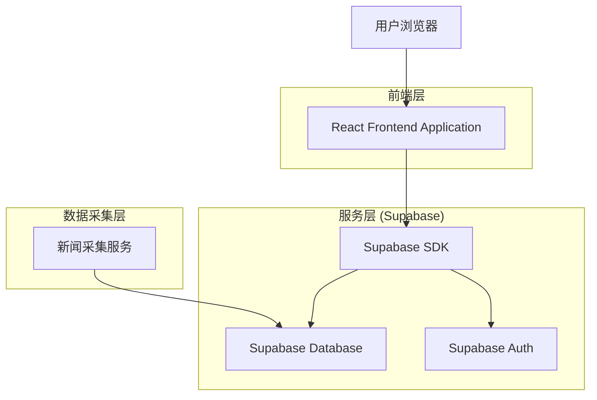
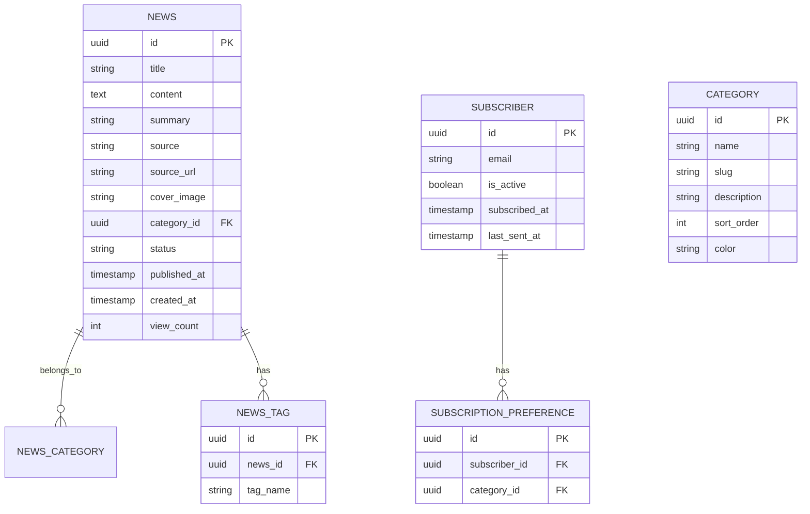
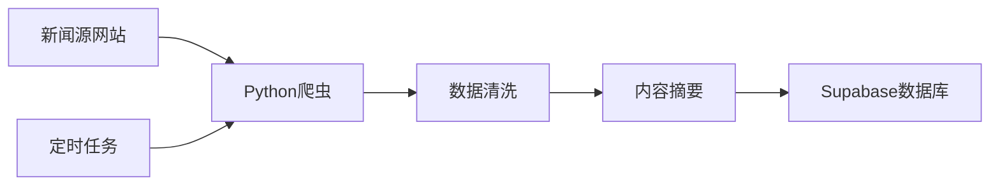

# 行业新闻聚合网站 - 技术架构文档

## 1. 架构设计



## 2. 技术描述

- **前端**: React@18 + TypeScript@5 + Tailwind CSS@3 + Vite@5
- **初始化工具**: vite-init
- **后端**: Supabase (PostgreSQL + Auth)
- **状态管理**: React Query (TanStack Query) + Zustand
- **路由**: React Router v6
- **UI组件**: shadcn/ui + Lucide React
- **数据采集**: Python脚本（独立服务，定时抓取新闻）

## 3. 路由定义

| 路由 | 用途 |
|------|------|
| / | 首页，展示新闻瀑布流和分类导航 |
| /category/:slug | 分类页，按分类展示新闻 |
| /news/:id | 新闻详情页，展示完整文章内容 |
| /search | 搜索页，关键词搜索和筛选 |
| /subscribe | 订阅页，邮箱订阅和管理 |
| /about | 关于页，网站介绍和联系方式 |

## 4. 组件设计

### 4.1 核心组件结构

```
src/
├── components/
│   ├── layout/
│   │   ├── Header.tsx          # 顶部导航栏
│   │   ├── Footer.tsx          # 底部页脚
│   │   ├── Sidebar.tsx         # 侧边栏
│   │   └── Layout.tsx          # 页面布局容器
│   ├── ui/                     # shadcn/ui 组件
│   ├── news/
│   │   ├── NewsCard.tsx        # 新闻卡片组件
│   │   ├── NewsList.tsx        # 新闻列表组件
│   │   ├── NewsDetail.tsx      # 新闻详情组件
│   │   └── CategoryNav.tsx     # 分类导航组件
│   ├── search/
│   │   ├── SearchBox.tsx       # 搜索框组件
│   │   └── SearchResults.tsx   # 搜索结果组件
│   └── subscribe/
│       ├── SubscribeForm.tsx   # 订阅表单
│       └── CategorySelect.tsx  # 分类选择器
├── hooks/
│   ├── useNews.ts              # 新闻数据获取
│   ├── useSearch.ts            # 搜索功能
│   └── useSubscribe.ts         # 订阅功能
├── stores/
│   └── useAppStore.ts          # Zustand 全局状态
├── lib/
│   ├── supabase.ts             # Supabase 客户端配置
│   └── utils.ts                # 工具函数
├── types/
│   └── index.ts                # TypeScript 类型定义
└── pages/
    ├── Home.tsx
    ├── Category.tsx
    ├── NewsDetail.tsx
    ├── Search.tsx
    ├── Subscribe.tsx
    └── About.tsx
```

## 5. 数据模型

### 5.1 数据模型定义



### 5.2 数据定义语言

**分类表 (categories)**
```sql
-- 创建分类表
CREATE TABLE categories (
    id UUID PRIMARY KEY DEFAULT gen_random_uuid(),
    name VARCHAR(50) NOT NULL,
    slug VARCHAR(50) UNIQUE NOT NULL,
    description TEXT,
    sort_order INTEGER DEFAULT 0,
    color VARCHAR(20) DEFAULT '#1e40af',
    created_at TIMESTAMP WITH TIME ZONE DEFAULT NOW()
);

-- 初始化分类数据
INSERT INTO categories (name, slug, description, sort_order, color) VALUES
('数据中心', 'data-center', '数据中心建设、运营、技术动态', 1, '#1e40af'),
('IDC', 'idc', '互联网数据中心行业资讯', 2, '#059669'),
('CDN', 'cdn', '内容分发网络技术与市场', 3, '#7c3aed'),
('云计算', 'cloud-computing', '云计算服务与技术趋势', 4, '#0891b2'),
('政策法规', 'policy', '行业政策、监管动态、法规解读', 5, '#ea580c'),
('风险提示', 'risk', '行业风险、安全预警、市场警示', 6, '#dc2626');
```

**新闻表 (news)**
```sql
-- 创建新闻表
CREATE TABLE news (
    id UUID PRIMARY KEY DEFAULT gen_random_uuid(),
    title VARCHAR(255) NOT NULL,
    content TEXT NOT NULL,
    summary TEXT,
    source VARCHAR(100) NOT NULL,
    source_url TEXT,
    cover_image TEXT,
    category_id UUID REFERENCES categories(id),
    status VARCHAR(20) DEFAULT 'published' CHECK (status IN ('draft', 'published', 'archived')),
    published_at TIMESTAMP WITH TIME ZONE,
    created_at TIMESTAMP WITH TIME ZONE DEFAULT NOW(),
    updated_at TIMESTAMP WITH TIME ZONE DEFAULT NOW(),
    view_count INTEGER DEFAULT 0
);

-- 创建索引
CREATE INDEX idx_news_category ON news(category_id);
CREATE INDEX idx_news_published_at ON news(published_at DESC);
CREATE INDEX idx_news_status ON news(status);
CREATE INDEX idx_news_created_at ON news(created_at DESC);
```

**新闻标签表 (news_tags)**
```sql
-- 创建新闻标签表
CREATE TABLE news_tags (
    id UUID PRIMARY KEY DEFAULT gen_random_uuid(),
    news_id UUID REFERENCES news(id) ON DELETE CASCADE,
    tag_name VARCHAR(50) NOT NULL,
    created_at TIMESTAMP WITH TIME ZONE DEFAULT NOW()
);

CREATE INDEX idx_news_tags_news_id ON news_tags(news_id);
CREATE INDEX idx_news_tags_name ON news_tags(tag_name);
```

**订阅用户表 (subscribers)**
```sql
-- 创建订阅用户表
CREATE TABLE subscribers (
    id UUID PRIMARY KEY DEFAULT gen_random_uuid(),
    email VARCHAR(255) UNIQUE NOT NULL,
    is_active BOOLEAN DEFAULT true,
    subscribed_at TIMESTAMP WITH TIME ZONE DEFAULT NOW(),
    last_sent_at TIMESTAMP WITH TIME ZONE,
    unsubscribe_token VARCHAR(255) UNIQUE
);

CREATE INDEX idx_subscribers_email ON subscribers(email);
CREATE INDEX idx_subscribers_active ON subscribers(is_active);
```

**订阅偏好表 (subscription_preferences)**
```sql
-- 创建订阅偏好表
CREATE TABLE subscription_preferences (
    id UUID PRIMARY KEY DEFAULT gen_random_uuid(),
    subscriber_id UUID REFERENCES subscribers(id) ON DELETE CASCADE,
    category_id UUID REFERENCES categories(id) ON DELETE CASCADE,
    UNIQUE(subscriber_id, category_id)
);

CREATE INDEX idx_sub_prefs_subscriber ON subscription_preferences(subscriber_id);
```

### 5.3 Row Level Security (RLS) 策略

```sql
-- 启用RLS
ALTER TABLE news ENABLE ROW LEVEL SECURITY;
ALTER TABLE categories ENABLE ROW LEVEL SECURITY;
ALTER TABLE subscribers ENABLE ROW LEVEL SECURITY;

-- 新闻表策略：所有人可查看已发布新闻
CREATE POLICY "News are viewable by everyone" 
ON news FOR SELECT 
USING (status = 'published');

-- 分类表策略：所有人可查看
CREATE POLICY "Categories are viewable by everyone" 
ON categories FOR SELECT 
TO anon, authenticated 
USING (true);

-- 订阅表策略：仅服务角色可管理
CREATE POLICY "Subscribers insertable by anon" 
ON subscribers FOR INSERT 
TO anon 
WITH CHECK (true);

CREATE POLICY "Subscribers viewable by owner" 
ON subscribers FOR SELECT 
USING (auth.uid() IS NULL OR email = auth.jwt()->>'email');
```

## 6. 状态管理方案

### 6.1 React Query 数据获取

```typescript
// hooks/useNews.ts
export const useNews = (category?: string, limit = 20) => {
  return useQuery({
    queryKey: ['news', category, limit],
    queryFn: async () => {
      let query = supabase
        .from('news')
        .select('*, categories(name, slug)')
        .eq('status', 'published')
        .order('published_at', { ascending: false })
        .limit(limit);
      
      if (category) {
        query = query.eq('categories.slug', category);
      }
      
      const { data, error } = await query;
      if (error) throw error;
      return data;
    },
    staleTime: 5 * 60 * 1000, // 5分钟缓存
  });
};
```

### 6.2 Zustand 全局状态

```typescript
// stores/useAppStore.ts
interface AppState {
  selectedCategory: string | null;
  searchQuery: string;
  setSelectedCategory: (category: string | null) => void;
  setSearchQuery: (query: string) => void;
}

export const useAppStore = create<AppState>((set) => ({
  selectedCategory: null,
  searchQuery: '',
  setSelectedCategory: (category) => set({ selectedCategory: category }),
  setSearchQuery: (query) => set({ searchQuery: query }),
}));
```

## 7. 响应式设计策略

### 7.1 断点定义

```css
/* tailwind.config.ts */
module.exports = {
  theme: {
    screens: {
      'sm': '640px',   /* 移动端 */
      'md': '768px',   /* 平板 */
      'lg': '1024px',  /* 小桌面 */
      'xl': '1280px',  /* 标准桌面 */
      '2xl': '1536px', /* 大桌面 */
    },
  },
}
```

### 7.2 布局适配规则

| 断点 | 新闻网格 | 侧边栏 | 导航 |
|------|----------|--------|------|
| < 768px | 1列 | 隐藏/底部 | 汉堡菜单 |
| 768px - 1023px | 2列 | 底部 | 横向滚动 |
| 1024px+ | 3列 | 右侧固定 | 完整展示 |

### 7.3 关键响应式类

```tsx
// 新闻网格响应式
<div className="grid grid-cols-1 md:grid-cols-2 lg:grid-cols-3 gap-6">
  {news.map(item => <NewsCard key={item.id} data={item} />)}
</div>

// 侧边栏响应式
<aside className="hidden lg:block w-80 flex-shrink-0">
  <Sidebar />
</aside>

// 分类导航响应式
<nav className="flex overflow-x-auto lg:overflow-visible gap-2 pb-2 lg:pb-0">
  {categories.map(cat => <CategoryTag key={cat.id} {...cat} />)}
</nav>
```

## 8. 数据采集方案

### 8.1 采集服务架构



### 8.2 采集流程

1. **定时触发**: 使用 GitHub Actions 或 cron 每周一凌晨执行
2. **多源采集**: 爬取行业媒体、政府网站、企业公告等
3. **智能去重**: 基于标题相似度检测重复新闻
4. **自动摘要**: 使用 NLP 提取新闻核心内容
5. **分类标注**: 基于关键词自动分类到对应栏目
6. **人工审核**: 可选，发布前人工确认重要新闻

### 8.3 技术实现

```python
# 数据采集脚本示例 (scripts/crawler.py)
import requests
from bs4 import BeautifulSoup
from supabase import create_client
import schedule
import time

SUPABASE_URL = "your-project-url"
SUPABASE_KEY = "your-service-role-key"

supabase = create_client(SUPABASE_URL, SUPABASE_KEY)

def fetch_news():
    # 爬取逻辑
    sources = [
        {"name": "工信部", "url": "..."},
        {"name": "IDC圈", "url": "..."},
        # ...
    ]
    
    for source in sources:
        news_items = crawl_source(source)
        for item in news_items:
            # 去重检查
            existing = supabase.table("news").select("id").eq("source_url", item["url"]).execute()
            if not existing.data:
                # 插入新数据
                supabase.table("news").insert({
                    "title": item["title"],
                    "content": item["content"],
                    "summary": generate_summary(item["content"]),
                    "source": source["name"],
                    "source_url": item["url"],
                    "category_id": classify_category(item["title"]),
                    "published_at": item["published_at"],
                    "status": "published"
                }).execute()

# 每周一凌晨3点执行
schedule.every().monday.at("03:00").do(fetch_news)
```

## 9. 性能优化策略

### 9.1 前端优化

- **图片优化**: 使用 WebP 格式，懒加载，响应式图片
- **代码分割**: 按路由懒加载组件
- **数据缓存**: React Query 缓存策略，减少重复请求
- **虚拟滚动**: 新闻列表使用虚拟滚动处理大量数据

### 9.2 数据库优化

- **索引优化**: 已为常用查询字段创建索引
- **分页查询**: 使用 cursor-based 分页避免深度分页问题
- **数据归档**: 超过90天的旧新闻自动归档

### 9.3 部署优化

- **CDN**: 静态资源使用 CDN 加速
- **边缘缓存**: 使用 Vercel Edge Network 缓存页面
- **增量静态生成**: 新闻详情页使用 ISR 策略

## 10. 项目初始化命令

```bash
# 1. 创建项目
npm create vite@latest industry-news -- --template react-ts

# 2. 安装依赖
cd industry-news
npm install

# 3. 安装 UI 框架和工具
npm install -D tailwindcss postcss autoprefixer
npx tailwindcss init -p

# 4. 安装 shadcn/ui
npx shadcn-ui@latest init

# 5. 安装核心依赖
npm install @supabase/supabase-js @tanstack/react-query zustand react-router-dom lucide-react

# 6. 安装开发依赖
npm install -D @types/node

# 7. 启动开发服务器
npm run dev
```